# Picasso Analytics Architecture - Complete System Documentation

**Document Version**: 1.0
**Last Updated**: December 25, 2025
**Status**: Production Active

---

## Table of Contents

1. [Diagram 1: Bubble Dashboard Architecture (Legacy/Current)](#diagram-1-bubble-dashboard-architecture-legacycurrent)
2. [Diagram 2: New React Analytics Dashboard Architecture](#diagram-2-new-react-analytics-dashboard-architecture)
3. [Component Inventory](#component-inventory)
4. [Data Flow Details](#data-flow-details)
5. [Known Issues](#known-issues)

---

## Diagram 1: Bubble Dashboard Architecture (Legacy/Current)

### System Overview

The Bubble Dashboard is the **original analytics system** serving external stakeholders via Bubble.io frontend. It uses a **three-tier data query system** to handle data across different retention windows.

```mermaid
graph TB
    subgraph "Frontend Layer"
        PW[Picasso Widget<br/>React/TypeScript]
        BD[Bubble Dashboard<br/>External UI]
    end

    subgraph "API Gateway Layer"
        APIG1[API Gateway<br/>Master Function Endpoint]
        APIG2[API Gateway<br/>Analytics Function Endpoint]
    end

    subgraph "Lambda Processing Layer - Chat"
        MFS[Master_Function_Staging<br/>Python<br/>Authentication/Routing]
        BSH[Bedrock_Streaming_Handler_Staging<br/>Node.js 20.x<br/>SSE Streaming]
    end

    subgraph "Lambda Processing Layer - Analytics"
        AF[Analytics_Function<br/>Python<br/>Three-Tier Query Engine]
    end

    subgraph "AI/ML Layer"
        BDK[AWS Bedrock<br/>Claude 3.5 Haiku]
        KBRT[Bedrock Agent Runtime<br/>Knowledge Base RAG]
    end

    subgraph "Data Storage - S3"
        S3CFG[S3: myrecruiter-picasso<br/>Tenant Configs]
        S3ARC[S3: picasso-analytics-archive<br/>Daily Aggregates >90 days<br/>Path: daily-aggregates/YYYY/MM/DD/tenant_id.json.gz]
    end

    subgraph "Data Storage - DynamoDB"
        DDBAUD[DynamoDB: picasso-analytics-audit<br/>Audit Trail]
        DDBBL[DynamoDB: picasso-token-blacklist<br/>JWT Blacklist]
        DDBDAILY[DynamoDB: production-picasso-analytics-daily<br/>Aggregated Metrics 7-90 days<br/>PK: TENANT#tenant_id<br/>SK: DATE#YYYY-MM-DD or FORMS#YYYY-MM-DD]
        DDBCONV[DynamoDB: picasso-conversations<br/>Session History]
        DDBSUB[DynamoDB: picasso_form_submissions<br/>Form Data with PII]
    end

    subgraph "Logging & Metrics"
        CW[CloudWatch Logs<br/>Recent Data <7 days<br/>Log Group: /aws/lambda/Bedrock_Streaming_Handler_Staging<br/>Contains: QA_COMPLETE structured logs]
    end

    %% User Interaction Flow
    PW -->|User Chat Message<br/>JWT Token| APIG1
    APIG1 -->|Route /chat| MFS
    MFS -->|Validate JWT<br/>Check Blacklist| DDBBL
    MFS -->|Load Config| S3CFG
    MFS -->|Stream Request| BSH
    BSH -->|Invoke with Streaming| BDK
    BSH -->|Knowledge Base Query| KBRT
    BSH -->|SSE Stream| MFS
    BSH -->|Log QA_COMPLETE<br/>JSON Structured| CW
    MFS -->|Response| APIG1
    APIG1 -->|SSE Stream| PW

    %% Analytics Query Flow - Three Tier System
    BD -->|Query Analytics<br/>?tenant_hash=xxx<br/>?start_date=YYYY-MM-DD<br/>?end_date=YYYY-MM-DD| APIG2
    APIG2 -->|Route| AF
    AF -->|Tier 1: Recent <7 days| CW
    AF -->|Tier 2: Historical 7-90 days| DDBDAILY
    AF -->|Tier 3: Archive >90 days| S3ARC
    AF -->|Form Submissions Query| DDBDAILY
    AF -->|Resolve tenant_hash → tenant_id| S3CFG
    AF -->|Return JSON Metrics| APIG2
    APIG2 -->|Display Charts| BD

    %% Audit Logging
    MFS -->|Audit Events| DDBAUD
    BSH -->|Session State| DDBCONV

    %% Styling
    classDef frontend fill:#e1f5ff,stroke:#01579b,stroke-width:2px
    classDef lambda fill:#fff3e0,stroke:#e65100,stroke-width:2px
    classDef storage fill:#f3e5f5,stroke:#4a148c,stroke-width:2px
    classDef ai fill:#e8f5e9,stroke:#1b5e20,stroke-width:2px
    classDef logging fill:#fce4ec,stroke:#880e4f,stroke-width:2px

    class PW,BD frontend
    class MFS,BSH,AF lambda
    class S3CFG,S3ARC,DDBAUD,DDBBL,DDBDAILY,DDBCONV,DDBSUB storage
    class BDK,KBRT ai
    class CW logging
```



### Three-Tier Query System (Analytics_Function)

The Analytics_Function implements intelligent data routing based on age:

**Tier 1: CloudWatch Logs (0-7 days)**
- **Source**: `/aws/lambda/Bedrock_Streaming_Handler_Staging`
- **Data**: QA_COMPLETE structured JSON logs
- **Query Method**: CloudWatch Logs Insights
- **Performance**: 2-5 seconds
- **Use Case**: Real-time/recent analytics

**Tier 2: DynamoDB Daily Aggregates (7-90 days)**
- **Table**: `production-picasso-analytics-daily`
- **Partition Key**: `TENANT#{tenant_id}`
- **Sort Key**: `DATE#{YYYY-MM-DD}` or `FORMS#{YYYY-MM-DD}`
- **Query Method**: Direct GetItem per day
- **Performance**: 10-50ms per day
- **Use Case**: Historical trending, weekly/monthly reports

**Tier 3: S3 Archive (>90 days)**
- **Bucket**: `picasso-analytics-archive`
- **Path**: `daily-aggregates/{YYYY}/{MM}/{DD}/{tenant_id}.json.gz`
- **Format**: Gzipped JSON
- **Query Method**: S3 GetObject per day
- **Performance**: 100-200ms per file
- **Use Case**: Long-term retention, compliance

### Data Aggregation Schema (DynamoDB)

```json
{
  "pk": "TENANT#{tenant_id}",
  "sk": "DATE#{YYYY-MM-DD}",
  "conversation_count": 142,
  "total_messages": 284,
  "avg_response_time_ms": 1250.5,
  "avg_first_token_ms": 850.2,
  "avg_total_time_ms": 2100.8,
  "after_hours_count": 45,
  "streaming_enabled_count": 142,
  "top_questions": [
    {"question": "How can I volunteer?", "count": 23},
    {"question": "What are your hours?", "count": 18}
  ],
  "hourly_distribution": {"9": 12, "10": 18, "11": 15},
  "daily_distribution": {"0": 25, "1": 32, "2": 28},
  "conversations": [
    {
      "session_id": "sess_abc123",
      "timestamp": "2025-12-20T14:23:45Z",
      "question": "How can I help?",
      "answer": "You can volunteer...",
      "response_time_ms": 1200,
      "first_token_ms": 800,
      "total_time_ms": 2000
    }
  ]
}
```

### Form Submissions Schema (DynamoDB)

```json
{
  "pk": "TENANT#{tenant_id}",
  "sk": "FORMS#{YYYY-MM-DD}",
  "total_submissions": 28,
  "form_counts": {
    "volunteer_interest": 12,
    "donation_request": 8,
    "contact_form": 8
  },
  "submissions": [
    {
      "submission_id": "sub_xyz789",
      "form_id": "volunteer_interest",
      "form_title": "Volunteer Interest Form",
      "submitted_at": "2025-12-20T15:30:00Z",
      "form_data": {
        "first_name": "John",
        "last_name": "Doe",
        "email": "john@example.com"
      }
    }
  ]
}
```

---

## Diagram 2: New React Analytics Dashboard Architecture

### System Overview

The New Analytics Dashboard is a **modern React-based system** with **Athena for historical queries** and **DynamoDB for hot-path caching**. It replaces Bubble with a self-hosted TypeScript/React dashboard.

```mermaid
graph TB
    subgraph "Frontend Layer"
        PW2[Picasso Widget<br/>React/TypeScript<br/>Embedded Chat]
        RAD[React Analytics Dashboard<br/>TypeScript/Vite<br/>Self-Hosted UI]
    end

    subgraph "Lambda Function URL Layer"
        FURL1[Lambda Function URL<br/>Analytics_Dashboard_API]
    end

    subgraph "Lambda Processing - Chat & Events"
        MFS2[Master_Function_Staging<br/>Python<br/>Chat Router]
        BSH2[Bedrock_Streaming_Handler_Staging<br/>Node.js 20.x<br/>Chat Streaming + Event Generation]
    end

    subgraph "Lambda Processing - Analytics Pipeline"
        ADA[Analytics_Dashboard_API<br/>Python<br/>REST API with Hot/Cold Paths]
        AGG[Analytics_Aggregator<br/>Python<br/>EventBridge Scheduled<br/>Hourly Pre-Computation]
        EP[Analytics_Event_Processor<br/>Python<br/>SQS Triggered<br/>S3 Writer for Athena]
    end

    subgraph "Event Queue"
        SQS[SQS: picasso-analytics-events<br/>Event Buffer<br/>DLQ: picasso-analytics-events-dlq]
    end

    subgraph "Data Lake - S3"
        S3EVENTS[S3: picasso-analytics<br/>Raw Event Data for Athena<br/>Path: analytics/tenant_id=XXX/year=YYYY/month=MM/day=DD/<br/>Format: NDJSON partitioned files]
        S3ATHENA[S3: picasso-analytics<br/>Athena Query Results<br/>Path: athena-results/]
        S3CFG2[S3: myrecruiter-picasso<br/>Tenant Configs + Mappings]
    end

    subgraph "Data Storage - DynamoDB"
        DDBAGG[DynamoDB: picasso-dashboard-aggregates<br/>Pre-Computed Metrics Cache<br/>PK: TENANT#tenant_id<br/>SK: METRIC#metric_type#range<br/>TTL: 24 hours]
        DDBSUB2[DynamoDB: picasso_form_submissions<br/>Form Submissions with PII<br/>Index: tenant-timestamp-index]
    end

    subgraph "Query Engine"
        ATHENA[AWS Athena<br/>Database: picasso_analytics<br/>Table: events<br/>Partitioned by tenant_id, year, month, day]
    end

    subgraph "Scheduler"
        EB[EventBridge Rule<br/>Schedule: Hourly<br/>Trigger: Analytics_Aggregator]
    end

    subgraph "AI Layer"
        BDK2[AWS Bedrock<br/>Claude 3.5 Haiku]
        KB2[Bedrock Knowledge Base<br/>RAG Context]
    end

    %% User Chat Flow with Event Generation
    PW2 -->|Chat Message<br/>JWT Auth| MFS2
    MFS2 -->|Stream to| BSH2
    BSH2 -->|Invoke| BDK2
    BSH2 -->|Query| KB2
    BSH2 -->|Generate Events:<br/>MESSAGE_SENT<br/>MESSAGE_RECEIVED<br/>FORM_STARTED<br/>FORM_COMPLETED| SQS
    BSH2 -->|SSE Stream| MFS2
    MFS2 -->|Response| PW2

    %% Event Processing Pipeline
    SQS -->|Batch Trigger<br/>Max 10 events| EP
    EP -->|Decode tenant_hash → tenant_id| S3CFG2
    EP -->|Write NDJSON<br/>Partitioned by date| S3EVENTS

    %% Athena Integration
    S3EVENTS -->|Hive-style partitions<br/>tenant_id/year/month/day| ATHENA
    ATHENA -->|Store Results| S3ATHENA

    %% Pre-Computation Flow
    EB -->|Hourly Trigger<br/>cron(0 * * * ? *)| AGG
    AGG -->|Get Active Tenants| S3CFG2
    AGG -->|Query Athena<br/>Time Ranges: 1d, 7d, 30d, 90d| ATHENA
    AGG -->|Store Metrics<br/>with TTL=24h| DDBAGG

    %% Dashboard Query Flow (Hot/Cold Path)
    RAD -->|GET /conversations/summary?range=30d<br/>GET /forms/summary?range=30d<br/>JWT Auth| FURL1
    FURL1 -->|Route| ADA
    ADA -->|HOT PATH: Check Cache<br/>Response Time: <100ms| DDBAGG
    ADA -->|COLD PATH: Query Athena<br/>Response Time: 5-30s<br/>If cache miss/stale| ATHENA
    ADA -->|Form Data Query| DDBSUB2
    ADA -->|JSON Response| FURL1
    FURL1 -->|Display| RAD

    %% Styling
    classDef frontend fill:#e1f5ff,stroke:#01579b,stroke-width:2px
    classDef lambda fill:#fff3e0,stroke:#e65100,stroke-width:2px
    classDef storage fill:#f3e5f5,stroke:#4a148c,stroke-width:2px
    classDef queue fill:#fff9c4,stroke:#f57f17,stroke-width:2px
    classDef query fill:#e0f2f1,stroke:#004d40,stroke-width:2px
    classDef ai fill:#e8f5e9,stroke:#1b5e20,stroke-width:2px

    class PW2,RAD frontend
    class MFS2,BSH2,ADA,AGG,EP lambda
    class S3EVENTS,S3ATHENA,S3CFG2,DDBAGG,DDBSUB2 storage
    class SQS queue
    class ATHENA query
    class BDK2,KB2 ai
    class EB queue
```

### Event Schema (Analytics Pipeline)

**MESSAGE_SENT Event** (from Bedrock_Streaming_Handler_Staging):
```json
{
  "event_id": "evt_abc123",
  "schema_version": "1.0.0",
  "session_id": "sess_xyz789",
  "tenant_id": "FOS402334",
  "tenant_hash": "fo85e6a06dcdf4",
  "step_number": 1,
  "event_type": "MESSAGE_SENT",
  "event_payload": {
    "content_preview": "How can I volunteer?",
    "character_count": 20,
    "word_count": 4
  },
  "client_timestamp": "2025-12-20T14:23:45.123Z",
  "server_timestamp": "2025-12-20T14:23:45.456Z",
  "ga_client_id": "123456789.1234567890",
  "environment": "staging"
}
```

**MESSAGE_RECEIVED Event**:
```json
{
  "event_id": "evt_def456",
  "schema_version": "1.0.0",
  "session_id": "sess_xyz789",
  "tenant_id": "FOS402334",
  "tenant_hash": "fo85e6a06dcdf4",
  "step_number": 1,
  "event_type": "MESSAGE_RECEIVED",
  "event_payload": {
    "content_preview": "You can volunteer by...",
    "response_time_ms": 1250,
    "first_token_ms": 850,
    "total_time_ms": 2100,
    "model_id": "anthropic.claude-3-haiku-20240307-v1:0",
    "knowledge_base_used": true
  },
  "client_timestamp": "2025-12-20T14:23:47.373Z",
  "server_timestamp": "2025-12-20T14:23:47.456Z",
  "environment": "staging"
}
```

**FORM_COMPLETED Event**:
```json
{
  "event_id": "evt_form123",
  "schema_version": "1.0.0",
  "session_id": "sess_xyz789",
  "tenant_id": "FOS402334",
  "tenant_hash": "fo85e6a06dcdf4",
  "step_number": 5,
  "event_type": "FORM_COMPLETED",
  "event_payload": {
    "form_id": "volunteer_interest",
    "form_label": "Volunteer Interest Form",
    "duration_seconds": 120,
    "fields_completed": 8,
    "submission_id": "sub_xyz123"
  },
  "client_timestamp": "2025-12-20T14:25:45.123Z",
  "server_timestamp": "2025-12-20T14:25:45.456Z",
  "environment": "staging"
}
```

### Athena Table Schema

**Database**: `picasso_analytics`
**Table**: `events`
**Format**: NDJSON (Newline-Delimited JSON)
**Partitioning**: Hive-style by `tenant_id`, `year`, `month`, `day`

```sql
CREATE EXTERNAL TABLE IF NOT EXISTS picasso_analytics.events (
  event_id STRING,
  schema_version STRING,
  session_id STRING,
  tenant_hash STRING,
  step_number INT,
  event_type STRING,
  event_payload STRING,
  client_timestamp STRING,
  server_timestamp STRING,
  ga_client_id STRING,
  environment STRING
)
PARTITIONED BY (
  tenant_id STRING,
  year INT,
  month INT,
  day INT
)
ROW FORMAT SERDE 'org.openx.data.jsonserde.JsonSerDe'
LOCATION 's3://picasso-analytics/analytics/'
TBLPROPERTIES ('has_encrypted_data'='false');
```

### DynamoDB Aggregates Cache Schema

**Table**: `picasso-dashboard-aggregates`
**Purpose**: Hot-path cache for sub-100ms dashboard queries

```json
{
  "pk": "TENANT#fo85e6a06dcdf4",
  "sk": "METRIC#conversations_summary#30d",
  "data": {
    "total_conversations": 142,
    "total_messages": 284,
    "avg_response_time_seconds": 1.25,
    "after_hours_percentage": 31.7
  },
  "updated_at": "2025-12-20T15:00:00Z",
  "ttl": 1735084800
}
```

**Metric Types Cached**:
- `conversations_summary#{range}` - Total counts, response times
- `conversations_heatmap#{range}` - Day × Hour grid
- `conversations_trend#{range}` - Time series data
- `top_questions#{range}` - Most frequent questions
- `forms_summary#{range}` - Form metrics
- `forms_bottlenecks#{range}` - Field abandonment
- `forms_top_performers#{range}` - Form rankings
- `analytics_summary#{range}` - Overall dashboard metrics
- `analytics_funnel#{range}` - Conversion funnel

---

## Component Inventory

### Lambda Functions

| Function Name | Runtime | Purpose | Trigger | Key Dependencies |
|--------------|---------|---------|---------|-----------------|
| **Master_Function_Staging** | Python 3.11 | JWT auth, routing, chat orchestration | API Gateway | boto3, jwt, tenant_config_loader |
| **Bedrock_Streaming_Handler_Staging** | Node.js 20.x | SSE streaming, Knowledge Base RAG, event generation | Master_Function | @aws-sdk/client-bedrock-runtime, @aws-sdk/client-sqs |
| **Analytics_Function** | Python 3.11 | Three-tier analytics query (CloudWatch/DynamoDB/S3) | API Gateway (Bubble) | boto3, pytz |
| **Analytics_Dashboard_API** | Python 3.11 | REST API with hot/cold paths for React dashboard | Lambda Function URL | boto3 (Athena, DynamoDB) |
| **Analytics_Aggregator** | Python 3.11 | Pre-compute metrics for hot-path cache | EventBridge (hourly) | boto3 (Athena, DynamoDB, S3) |
| **Analytics_Event_Processor** | Python 3.11 | SQS → S3 writer for Athena ingestion | SQS (picasso-analytics-events) | boto3 (S3) |

### DynamoDB Tables

| Table Name | Purpose | Partition Key | Sort Key | Indexes | TTL |
|-----------|---------|--------------|----------|---------|-----|
| **production-picasso-analytics-daily** | Daily aggregated metrics (7-90 days) | `pk` (TENANT#) | `sk` (DATE# or FORMS#) | None | No |
| **picasso-dashboard-aggregates** | Pre-computed dashboard metrics (hot cache) | `pk` (TENANT#) | `sk` (METRIC#type#range) | None | Yes (24h) |
| **picasso_form_submissions** | Form submission data with PII | `submission_id` | - | `tenant-timestamp-index` | No |
| **picasso-conversations** | Session history and state | `conversation_id` | - | None | No |
| **picasso-analytics-audit** | Audit trail for all requests | `audit_id` | `timestamp` | None | No |
| **picasso-token-blacklist** | Revoked JWT tokens | `token_hash` | - | None | Yes |

### S3 Buckets

| Bucket Name | Purpose | Path Structure | Format | Retention |
|------------|---------|----------------|--------|-----------|
| **myrecruiter-picasso** | Tenant configs, mappings | `tenants/{tenant_id}/{tenant_id}-config.json`<br/>`mappings/{tenant_hash}.json` | JSON | Indefinite |
| **picasso-analytics-archive** | Long-term daily aggregates (>90 days) | `daily-aggregates/{YYYY}/{MM}/{DD}/{tenant_id}.json.gz` | Gzipped JSON | 7 years |
| **picasso-analytics** | Raw event data for Athena + query results | `analytics/tenant_id={id}/year={Y}/month={M}/day={D}/*.json`<br/>`athena-results/*` | NDJSON | 90 days |

### SQS Queues

| Queue Name | Purpose | Visibility Timeout | Dead Letter Queue |
|-----------|---------|-------------------|-------------------|
| **picasso-analytics-events** | Event buffer for processing | 300s | picasso-analytics-events-dlq |
| **picasso-analytics-events-dlq** | Failed event storage | - | - |

### CloudWatch Log Groups

| Log Group | Purpose | Retention | Key Structured Logs |
|-----------|---------|-----------|---------------------|
| `/aws/lambda/Bedrock_Streaming_Handler_Staging` | Chat streaming logs + QA_COMPLETE events | 7 days | QA_COMPLETE (JSON) |
| `/aws/lambda/Master_Function_Staging` | Authentication and routing logs | 7 days | JWT validation, route decisions |
| `/aws/lambda/Analytics_Event_Processor` | Event processing logs | 7 days | S3 write confirmations |
| `/aws/lambda/Analytics_Aggregator` | Aggregation job logs | 7 days | Athena query execution |

### API Gateway Endpoints

| Endpoint | Method | Lambda Target | Authentication |
|----------|--------|---------------|----------------|
| `/prod/chat` | POST | Master_Function_Staging | JWT (Bearer token) |
| `/prod/analytics` | GET | Analytics_Function | API Key or JWT |

### Lambda Function URLs

| URL | Lambda Target | CORS | Authentication |
|-----|---------------|------|----------------|
| `https://*.lambda-url.us-east-1.on.aws/` | Analytics_Dashboard_API | Enabled | JWT (Bearer token) |

### EventBridge Rules

| Rule Name | Schedule | Target | Purpose |
|-----------|----------|--------|---------|
| `picasso-analytics-aggregator-hourly` | `cron(0 * * * ? *)` | Analytics_Aggregator | Pre-compute dashboard metrics every hour |

---

## Data Flow Details

### Chat Message Flow (Both Systems)

1. **User sends message** via Picasso Widget (React)
2. **Master_Function_Staging** validates JWT token against blacklist
3. **Master_Function_Staging** loads tenant config from S3
4. **Master_Function_Staging** routes to Bedrock_Streaming_Handler_Staging
5. **Bedrock_Streaming_Handler_Staging** queries Bedrock Knowledge Base for RAG context
6. **Bedrock_Streaming_Handler_Staging** invokes Claude 3.5 Haiku with streaming
7. **Bedrock_Streaming_Handler_Staging** generates analytics events (MESSAGE_SENT, MESSAGE_RECEIVED)
8. **Bedrock_Streaming_Handler_Staging** sends events to SQS (New System) or logs to CloudWatch (Legacy)
9. **Master_Function_Staging** returns SSE stream to widget

### Legacy Analytics Query Flow (Bubble Dashboard)

1. **Bubble Dashboard** sends GET request to API Gateway
2. **API Gateway** routes to Analytics_Function
3. **Analytics_Function** determines data age and routes query:
   - **Recent (<7 days)**: Query CloudWatch Logs for QA_COMPLETE events
   - **Historical (7-90 days)**: Query DynamoDB `production-picasso-analytics-daily` table
   - **Archive (>90 days)**: Fetch from S3 `picasso-analytics-archive` bucket
4. **Analytics_Function** merges results from all tiers
5. **Analytics_Function** returns JSON response with metrics
6. **Bubble Dashboard** renders charts and tables

### New Analytics Query Flow (React Dashboard)

1. **React Dashboard** sends GET request to Lambda Function URL
2. **Analytics_Dashboard_API** authenticates JWT token
3. **Analytics_Dashboard_API** tries HOT PATH:
   - Check DynamoDB `picasso-dashboard-aggregates` for cached metric
   - If found and fresh (<2 hours old): Return immediately (sub-100ms)
4. **Analytics_Dashboard_API** falls back to COLD PATH if cache miss:
   - Query Athena `picasso_analytics.events` table
   - Wait for query execution (5-30 seconds)
   - Return results to dashboard
5. **React Dashboard** renders charts in real-time

### Event Processing Flow (New System Only)

1. **Bedrock_Streaming_Handler_Staging** generates MESSAGE_SENT/MESSAGE_RECEIVED events
2. **SQS Queue** buffers events (batch size: up to 10 events)
3. **Analytics_Event_Processor** triggered by SQS
4. **Analytics_Event_Processor** decodes tenant_hash → tenant_id using S3 mappings
5. **Analytics_Event_Processor** writes NDJSON files to S3 with Hive-style partitioning:
   - Path: `s3://picasso-analytics/analytics/tenant_id=FOS402334/year=2025/month=12/day=20/*.json`
6. **Athena** discovers partitions automatically
7. **Analytics_Aggregator** runs hourly via EventBridge
8. **Analytics_Aggregator** queries Athena for all active tenants
9. **Analytics_Aggregator** writes pre-computed metrics to DynamoDB cache with 24h TTL

### Form Submission Flow (Both Systems)

1. **Picasso Widget** user completes conversational form
2. **Widget** sends POST to Master_Function_Staging `/form_submission`
3. **Master_Function_Staging** delegates to form_handler module
4. **form_handler** writes to DynamoDB `picasso_form_submissions` table
5. **form_handler** generates FORM_COMPLETED event to SQS (New System)
6. **Analytics_Event_Processor** processes event and writes to S3
7. **Athena** makes data queryable for dashboard

---

## Known Issues

### Issue 1: MESSAGE Events Not Reaching S3 (New System)

**Status**: 🔴 BROKEN
**Impact**: Conversations Dashboard has no data
**Affected Components**:
- Bedrock_Streaming_Handler_Staging (event generation)
- SQS: picasso-analytics-events
- Analytics_Event_Processor (S3 writer)

**Root Cause**: Unknown - requires investigation
**Symptoms**:
- SQS queue receives messages
- Analytics_Event_Processor processes messages
- But S3 files are not being written to `picasso-analytics/analytics/` path
- Athena table shows 0 rows for MESSAGE_SENT/MESSAGE_RECEIVED

**Debug Steps Needed**:
1. Check CloudWatch Logs for Analytics_Event_Processor errors
2. Verify S3 bucket permissions for Lambda execution role
3. Check if NDJSON format is correct
4. Verify Hive partitioning path structure
5. Test with manual SQS message injection

### Issue 2: Forms Events Working (New System)

**Status**: ✅ WORKING
**Impact**: Forms analytics dashboard functional
**Evidence**:
- FORM_STARTED, FORM_COMPLETED, FORM_ABANDONED events reach S3
- Athena queries return form data
- Dashboard displays form metrics correctly

**Why This Works**:
- Form events follow same SQS → Event Processor → S3 pipeline
- Suggests issue is specific to MESSAGE events, not infrastructure
- Possible difference in event payload structure or size

### Issue 3: Aggregator Pre-Computation Working

**Status**: ✅ WORKING
**Impact**: Hot-path queries return in <100ms
**Evidence**:
- EventBridge triggers Analytics_Aggregator hourly
- Aggregator queries Athena successfully
- DynamoDB cache populated with metrics
- Dashboard API returns cached data with `source: 'cache'`

### Issue 4: CloudWatch Retention (Legacy System)

**Status**: ⚠️ LIMITATION
**Impact**: Only 7 days of real-time data available
**Mitigation**: Three-tier system falls back to DynamoDB/S3 for older data
**Recommendation**: Migrate to Athena-based system for unified query interface

---

## File Paths Reference

### Lambda Function Code Locations

```
/Users/chrismiller/Desktop/Working_Folder/Lambdas/lambda/
├── Master_Function_Staging/
│   └── lambda_function.py                    # Main routing and auth logic
├── Bedrock_Streaming_Handler_Staging/
│   └── index.js                              # SSE streaming + event generation (Node.js)
├── Analytics_Function/
│   ├── lambda_function.py                    # Three-tier query engine
│   ├── cloudwatch_reader.py                  # CloudWatch Logs client
│   └── tenant_resolver.py                    # Hash → ID mapping
├── Analytics_Dashboard_API/
│   └── lambda_function.py                    # REST API with hot/cold paths
├── Analytics_Aggregator/
│   └── lambda_function.py                    # Hourly pre-computation job
└── Analytics_Event_Processor/
    └── lambda_function.py                    # SQS → S3 writer
```

### React Dashboard Location

```
/Users/chrismiller/Desktop/Working_Folder/picasso-analytics-dashboard/
├── src/
│   ├── components/                           # Reusable UI components
│   ├── pages/                                # Dashboard pages
│   ├── hooks/                                # React hooks for API calls
│   └── utils/                                # Utilities and helpers
├── package.json
└── vite.config.ts                            # Build configuration
```

---

## Revision History

| Version | Date | Author | Changes |
|---------|------|--------|---------|
| 1.0 | 2025-12-25 | System Architect | Initial comprehensive documentation |

