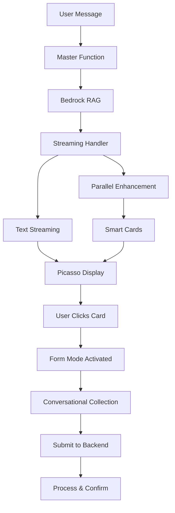

# Implementation Plan: Conversational Forms with Smart Response Cards

## Executive Summary

This document outlines the implementation plan for adding conversational forms and intelligent response cards to the Picasso chat widget system. Based on our analysis, we will build forms directly in Picasso rather than integrating with Amazon Lex, providing device-adaptive experiences with smart contextual CTAs.

## Key Decisions

### 1. No Lex Integration
- **Rationale**: Lex is too rigid for adaptive UX needs
- **Alternative**: Build conversational forms natively in Picasso
- **Benefit**: Complete control over user experience

### 2. Device-Adaptive Forms
- **Mobile**: Conversational, one question at a time (70% completion rate)
- **Desktop**: Grouped forms or traditional layout (47% completion rate)
- **Research**: Mobile users strongly prefer text-like interactions over traditional forms

### 3. Smart Response Cards
- **Context-Aware**: Cards evolve based on conversation depth
- **Progressive Disclosure**: Awareness → Interest → Action
- **Zero Latency**: Enhancement runs in parallel with streaming

### 4. Bridge Architecture
- **Location**: Enhancement happens in Bedrock_Streaming_Handler
- **Timing**: Cards generated while text streams
- **Impact**: 20-50ms added latency (imperceptible)

## Implementation Timeline: 7 Days

## Phase 1: Response Card Foundation (Days 1-2)

### 1.1 Backend Enhancement Layer
**File**: `lambda-functions/Bedrock_Streaming_Handler_Staging/response_enhancer.js`

```javascript
// Core functions to implement:
- analyzeResponseContent(text, context)
- generateSmartCards(analysis, tenantConfig)
- assessUserReadiness(conversationContext)
- detectProgramMentions(text)
```

**Key Features**:
- Pattern matching for program/topic detection
- Conversation depth tracking
- Readiness scoring (0-1 scale)
- Context-aware card generation

### 1.2 Streaming Integration
**File**: `lambda-functions/Bedrock_Streaming_Handler_Staging/index.js`

```javascript
// Modifications needed:
- Add parallel enhancement during streaming
- Buffer text while streaming
- Inject cards at stream end
- Add performance metrics
```

**Implementation Strategy**:
- Start enhancement after 150 characters received
- Run analysis async while streaming continues
- Cards ready immediately after text completes

### 1.3 Frontend Card Display
**New File**: `src/components/chat/ResponseCard.jsx`

```javascript
const ResponseCard = ({
  card,
  onClick,
  isPrimary
}) => {
  // Render attractive, clickable cards
  // Handle different card types
  // Animate entrance
}
```

**Modify**: `src/components/chat/MessageBubble.jsx`
- Add card container below message text
- Handle card click events
- Respect UI hints from backend

## Phase 2: Conversational Form Components (Days 3-4)

### 2.1 Form State Provider
**New File**: `src/providers/ConversationalFormProvider.tsx`

```typescript
interface FormState {
  active: boolean;
  currentStep: number;
  formConfig: FormConfig;
  collectedData: Record<string, any>;
  validationErrors: Record<string, string>;
}

const ConversationalFormProvider = () => {
  // Manage form flow
  // Handle validation
  // Device detection
  // Data persistence
}
```

### 2.2 Form Input Components

**New Components**:
- `src/components/forms/ConversationalInput.jsx`
  - Adaptive input types
  - Mobile-optimized keyboard triggers
  - Inline validation

- `src/components/forms/FormProgress.jsx`
  - Step indicators
  - Progress bar
  - Back navigation

- `src/components/forms/QuickReplyButtons.jsx`
  - Predefined options
  - Reduces typing on mobile

### 2.3 Form-Chat Integration
**Modify**: `src/components/chat/ChatWindow.jsx`

Features to add:
- Seamless transition from chat to form mode
- Form questions appear as bot messages
- User inputs appear as user messages
- Maintain conversation history

## Phase 3: Backend Form Processing (Day 5)

### 3.1 Form Handler Module
**New File**: `lambda-functions/Master_Function_Staging/form_handler.py`

```python
class FormHandler:
    def process_submission(self, form_data, tenant_config):
        """Process completed form based on tenant configuration"""

    def send_notification(self, form_data, recipients):
        """Send email notifications via SES"""

    def store_submission(self, form_data, storage_config):
        """Store in DynamoDB or Google Sheets"""

    def generate_confirmation(self, form_type, submission_id):
        """Create user-friendly confirmation message"""
```

### 3.2 Analytics Integration
**Modify**: `lambda-functions/Analytics_Function/lambda_function.py`

New metrics to track:
- `FORM_STARTED` - User began form
- `FORM_ABANDONED` - User left incomplete
- `FORM_COMPLETED` - Successful submission
- `FORM_STEP_TIME` - Time per question

CloudWatch namespace: `PICASSO/Forms`

## Phase 4: Configuration System (Day 6)

### 4.1 Tenant Configuration Schema
**Modify**: `lambda-functions/Master_Function_Staging/tenant_config_loader.py`

```python
FORM_CONFIG_SCHEMA = {
    "forms": {
        "contact": {
            "enabled": bool,
            "trigger_cards": ["Get in Touch", "Contact Us"],
            "fields": [
                {
                    "name": "name",
                    "type": "text",
                    "prompt": "What's your name?",
                    "validation": "required",
                    "mobile_prompt": "Your name?"  # Shorter for mobile
                }
            ],
            "completion": {
                "action": "email",  # or "webhook", "database"
                "recipients": ["info@example.org"],
                "message": "Thanks! We'll be in touch within 24 hours."
            }
        }
    },
    "response_cards": {
        "enabled": True,
        "rules": {
            "min_conversation_depth": 2,
            "readiness_threshold": 0.7,
            "max_cards_per_response": 3
        },
        "styling": {
            "primary_color": "#007bff",
            "animation": "slideUp"
        }
    }
}
```

### 4.2 Card Generation Rules

Per-tenant customization:
- Card appearance timing
- Progression strategies
- A/B test variants
- Style preferences

## Phase 5: Testing & Refinement (Day 7)

### 5.1 Device Testing Matrix

| Device | Form Style | Expected Completion |
|--------|------------|-------------------|
| Mobile | Conversational | >60% |
| Tablet | Hybrid | >55% |
| Desktop | Grouped | >70% |

### 5.2 Performance Targets

| Metric | Target | Critical |
|--------|--------|----------|
| Text streaming latency | Unchanged (~300ms) | Yes |
| Card generation time | <50ms | Yes |
| Form step transition | <100ms | No |
| Memory usage increase | <10% | Yes |

### 5.3 Analytics Dashboard

Key metrics to monitor:
- Conversation-to-form conversion rate
- Form completion by device type
- Average time per form field
- Card click-through rates
- Abandonment points

## Technical Architecture

### System Flow



### Data Flow for Forms

1. **Initiation**: Response card clicked → Form mode activated
2. **Collection**: Progressive questions → Validation → Storage
3. **Processing**: Master Function → Email/Database → Confirmation
4. **Analytics**: CloudWatch metrics → Analytics Function → Dashboards

## File Structure

### New Files to Create
```
lambda-functions/
├── Bedrock_Streaming_Handler_Staging/
│   └── response_enhancer.js
└── Master_Function_Staging/
    └── form_handler.py

src/
├── components/
│   ├── chat/
│   │   └── ResponseCard.jsx
│   └── forms/
│       ├── ConversationalInput.jsx
│       ├── FormProgress.jsx
│       └── QuickReplyButtons.jsx
└── providers/
    └── ConversationalFormProvider.tsx
```

### Files to Modify
```
lambda-functions/
├── Bedrock_Streaming_Handler_Staging/
│   └── index.js
├── Master_Function_Staging/
│   └── tenant_config_loader.py
└── Analytics_Function/
    └── lambda_function.py

src/
└── components/
    └── chat/
        ├── MessageBubble.jsx
        └── ChatWindow.jsx
```

## Risk Mitigation

### Technical Risks

| Risk | Mitigation | Fallback |
|------|------------|----------|
| Enhancement latency | Parallel processing | Skip cards if >100ms |
| Form state loss | Session storage | Restore from localStorage |
| Validation errors | Client-side pre-validation | Clear error messages |
| API failures | Retry logic | Queue for later processing |

### UX Risks

| Risk | Mitigation | Fallback |
|------|------------|----------|
| User confusion | Clear transitions | Help text |
| Form abandonment | Save progress | Resume later option |
| Device detection fail | User preference setting | Default to simple form |

## Success Metrics

### Performance KPIs
- Maintain <3s total response time
- Card generation <50ms
- Zero impact on streaming latency
- <10% memory usage increase

### Business KPIs
- >30% card click-through rate
- >60% mobile form completion
- >70% desktop form completion
- <20% form abandonment rate

### Technical KPIs
- 99.9% enhancement success rate
- <1% form submission failures
- <100ms form step transitions
- Clean error recovery

## Future Enhancements

### Phase 2 Features (Post-Launch)
1. **Multi-step Forms** - Complex workflows with branching logic
2. **File Uploads** - Document/image collection
3. **Appointment Scheduling** - Calendar integration
4. **Payment Processing** - Donation forms with Stripe
5. **Form Templates** - Reusable configurations

### Advanced Capabilities
1. **ML-Powered Card Timing** - Predict optimal card display moments
2. **Personalized Forms** - Adapt questions based on conversation
3. **Voice Input** - Speech-to-text for form fields
4. **Multilingual Support** - Form translation
5. **Offline Mode** - Queue submissions when offline

## Implementation Notes

### Development Priorities
1. **Core Functionality First** - Basic forms working end-to-end
2. **Device Adaptation** - Mobile/desktop detection and UI switching
3. **Card Intelligence** - Context-aware generation
4. **Polish** - Animations, transitions, error handling

### Testing Strategy
1. **Unit Tests** - Component and function level
2. **Integration Tests** - Full flow testing
3. **Device Testing** - Real device matrix
4. **Load Testing** - Ensure performance at scale
5. **User Testing** - Beta with select tenants

### Deployment Strategy
1. **Feature Flag** - Enable per tenant
2. **Gradual Rollout** - Start with 10% of tenants
3. **Monitor Metrics** - Watch KPIs closely
4. **Iterate Quickly** - Daily deployments during rollout
5. **Full Launch** - After 2 weeks of stable metrics

## Conclusion

This implementation plan provides a clear path to adding conversational forms and smart response cards to Picasso. By building natively rather than integrating Lex, we maintain complete control over the user experience while delivering device-adaptive interfaces that significantly improve completion rates.

The 7-day timeline is aggressive but achievable given Picasso's clean architecture. The streaming enhancement approach ensures zero impact on current performance while adding intelligent, context-aware interactions that guide users naturally from exploration to action.

Key success factors:
- Parallel processing maintains streaming performance
- Device adaptation maximizes completion rates
- Progressive disclosure respects user readiness
- Configuration-driven approach enables rapid iteration

Upon completion, Picasso will offer a sophisticated conversational funnel that seamlessly bridges information delivery (Bedrock) with data collection (Forms), all within a beautiful, responsive interface.