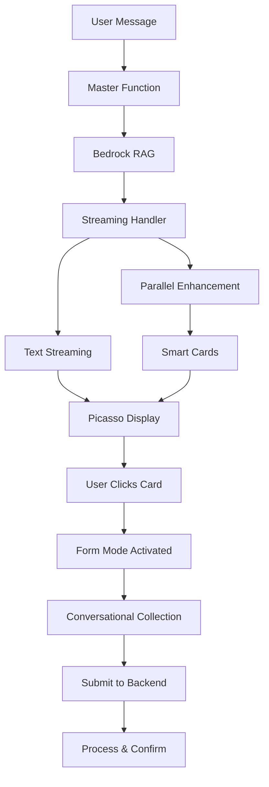

# Implementation Plan: Conversational Forms with Smart Response Cards

## Executive Summary

This document outlines the implementation plan for adding conversational forms and intelligent response cards to the Picasso chat widget system. Based on our analysis, we will build forms directly in Picasso rather than integrating with Amazon Lex, providing device-adaptive experiences with smart contextual CTAs.

## Key Decisions

### 1. No Lex Integration
- **Rationale**: Lex is too rigid for adaptive UX needs
- **Alternative**: Build conversational forms natively in Picasso
- **Benefit**: Complete control over user experience

### 2. Device-Adaptive Forms
- **Mobile**: Conversational, one question at a time (70% completion rate)
- **Desktop**: Grouped forms or traditional layout (47% completion rate)
- **Research**: Mobile users strongly prefer text-like interactions over traditional forms

### 3. Smart Response Cards
- **Context-Aware**: Cards evolve based on conversation depth
- **Progressive Disclosure**: Awareness → Interest → Action
- **Zero Latency**: Enhancement runs in parallel with streaming

### 4. Bridge Architecture
- **Location**: Enhancement happens in Bedrock_Streaming_Handler
- **Timing**: Cards generated while text streams
- **Impact**: 20-50ms added latency (imperceptible)

## Implementation Timeline: 7 Days

## Phase 1: Response Card Foundation (Days 1-2)

### 1.1 Backend Enhancement Layer
**File**: `lambda-functions/Bedrock_Streaming_Handler_Staging/response_enhancer.js`

```javascript
// Core functions to implement:
- analyzeResponseContent(text, context)
- generateSmartCards(analysis, tenantConfig)
- assessUserReadiness(conversationContext)
- detectProgramMentions(text)
```

**Key Features**:
- Pattern matching for program/topic detection
- Conversation depth tracking
- Readiness scoring (0-1 scale)
- Context-aware card generation

### 1.2 Streaming Integration
**File**: `lambda-functions/Bedrock_Streaming_Handler_Staging/index.js`

```javascript
// Modifications needed:
- Add parallel enhancement during streaming
- Buffer text while streaming
- Inject cards at stream end
- Add performance metrics
```

**Implementation Strategy**:
- Start enhancement after 150 characters received
- Run analysis async while streaming continues
- Cards ready immediately after text completes

### 1.3 Frontend Card Display
**New File**: `src/components/chat/ResponseCard.jsx`

```javascript
const ResponseCard = ({
  card,
  onClick,
  isPrimary
}) => {
  // Render attractive, clickable cards
  // Handle different card types
  // Animate entrance
}
```

**Modify**: `src/components/chat/MessageBubble.jsx`
- Add card container below message text
- Handle card click events
- Respect UI hints from backend

## Phase 2: Conversational Form Components (Days 3-4)

### 2.1 Form State Provider
**New File**: `src/providers/ConversationalFormProvider.tsx`

```typescript
interface FormState {
  active: boolean;
  currentStep: number;
  formConfig: FormConfig;
  collectedData: Record<string, any>;
  validationErrors: Record<string, string>;
}

const ConversationalFormProvider = () => {
  // Manage form flow
  // Handle validation
  // Device detection
  // Data persistence
}
```

### 2.2 Form Input Components

**New Components**:
- `src/components/forms/ConversationalInput.jsx`
  - Adaptive input types
  - Mobile-optimized keyboard triggers
  - Inline validation

- `src/components/forms/FormProgress.jsx`
  - Step indicators
  - Progress bar
  - Back navigation

- `src/components/forms/QuickReplyButtons.jsx`
  - Predefined options
  - Reduces typing on mobile

### 2.3 Form-Chat Integration
**Modify**: `src/components/chat/ChatWindow.jsx`

Features to add:
- Seamless transition from chat to form mode
- Form questions appear as bot messages
- User inputs appear as user messages
- Maintain conversation history

## Phase 3: Backend Form Processing (Day 5)

### 3.1 Form Handler Module
**New File**: `lambda-functions/Master_Function_Staging/form_handler.py`

```python
class FormHandler:
    def process_submission(self, form_data, tenant_config):
        """Process completed form based on tenant configuration"""

    def send_notification(self, form_data, recipients):
        """Send email notifications via SES"""

    def store_submission(self, form_data, storage_config):
        """Store in DynamoDB or Google Sheets"""

    def generate_confirmation(self, form_type, submission_id):
        """Create user-friendly confirmation message"""
```

### 3.2 Analytics Integration
**Modify**: `lambda-functions/Analytics_Function/lambda_function.py`

New metrics to track:
- `FORM_STARTED` - User began form
- `FORM_ABANDONED` - User left incomplete
- `FORM_COMPLETED` - Successful submission
- `FORM_STEP_TIME` - Time per question

CloudWatch namespace: `PICASSO/Forms`

## Phase 4: Configuration System (Day 6)

### 4.1 Tenant Configuration Schema
**Modify**: `lambda-functions/Master_Function_Staging/tenant_config_loader.py`

```python
FORM_CONFIG_SCHEMA = {
    "forms": {
        "contact": {
            "enabled": bool,
            "trigger_cards": ["Get in Touch", "Contact Us"],
            "fields": [
                {
                    "name": "name",
                    "type": "text",
                    "prompt": "What's your name?",
                    "validation": "required",
                    "mobile_prompt": "Your name?"  # Shorter for mobile
                }
            ],
            "completion": {
                "action": "email",  # or "webhook", "database"
                "recipients": ["info@example.org"],
                "message": "Thanks! We'll be in touch within 24 hours."
            }
        }
    },
    "response_cards": {
        "enabled": True,
        "rules": {
            "min_conversation_depth": 2,
            "readiness_threshold": 0.7,
            "max_cards_per_response": 3
        },
        "styling": {
            "primary_color": "#007bff",
            "animation": "slideUp"
        }
    }
}
```

### 4.2 Card Generation Rules

Per-tenant customization:
- Card appearance timing
- Progression strategies
- A/B test variants
- Style preferences

## Phase 5: Testing & Refinement (Day 7)

### 5.1 Device Testing Matrix

| Device | Form Style | Expected Completion |
|--------|------------|-------------------|
| Mobile | Conversational | >60% |
| Tablet | Hybrid | >55% |
| Desktop | Grouped | >70% |

### 5.2 Performance Targets

| Metric | Target | Critical |
|--------|--------|----------|
| Text streaming latency | Unchanged (~300ms) | Yes |
| Card generation time | <50ms | Yes |
| Form step transition | <100ms | No |
| Memory usage increase | <10% | Yes |

### 5.3 Analytics Dashboard

Key metrics to monitor:
- Conversation-to-form conversion rate
- Form completion by device type
- Average time per form field
- Card click-through rates
- Abandonment points

## Technical Architecture

### System Flow



### Data Flow for Forms

1. **Initiation**: Response card clicked → Form mode activated
2. **Collection**: Progressive questions → Validation → Storage
3. **Processing**: Master Function → Email/Database → Confirmation
4. **Analytics**: CloudWatch metrics → Analytics Function → Dashboards

## File Structure

### New Files to Create
```
lambda-functions/
├── Bedrock_Streaming_Handler_Staging/
│   └── response_enhancer.js
└── Master_Function_Staging/
    └── form_handler.py

src/
├── components/
│   ├── chat/
│   │   └── ResponseCard.jsx
│   └── forms/
│       ├── ConversationalInput.jsx
│       ├── FormProgress.jsx
│       └── QuickReplyButtons.jsx
└── providers/
    └── ConversationalFormProvider.tsx
```

### Files to Modify
```
lambda-functions/
├── Bedrock_Streaming_Handler_Staging/
│   └── index.js
├── Master_Function_Staging/
│   └── tenant_config_loader.py
└── Analytics_Function/
    └── lambda_function.py

src/
└── components/
    └── chat/
        ├── MessageBubble.jsx
        └── ChatWindow.jsx
```

## Risk Mitigation

### Technical Risks

| Risk | Mitigation | Fallback |
|------|------------|----------|
| Enhancement latency | Parallel processing | Skip cards if >100ms |
| Form state loss | Session storage | Restore from localStorage |
| Validation errors | Client-side pre-validation | Clear error messages |
| API failures | Retry logic | Queue for later processing |

### UX Risks

| Risk | Mitigation | Fallback |
|------|------------|----------|
| User confusion | Clear transitions | Help text |
| Form abandonment | Save progress | Resume later option |
| Device detection fail | User preference setting | Default to simple form |

## Success Metrics

### Performance KPIs
- Maintain <3s total response time
- Card generation <50ms
- Zero impact on streaming latency
- <10% memory usage increase

### Business KPIs
- >30% card click-through rate
- >60% mobile form completion
- >70% desktop form completion
- <20% form abandonment rate

### Technical KPIs
- 99.9% enhancement success rate
- <1% form submission failures
- <100ms form step transitions
- Clean error recovery

## Future Enhancements

### Phase 2 Features (Post-Launch)
1. **Multi-step Forms** - Complex workflows with branching logic
2. **File Uploads** - Document/image collection
3. **Appointment Scheduling** - Calendar integration
4. **Payment Processing** - Donation forms with Stripe
5. **Form Templates** - Reusable configurations

### Advanced Capabilities
1. **ML-Powered Card Timing** - Predict optimal card display moments
2. **Personalized Forms** - Adapt questions based on conversation
3. **Voice Input** - Speech-to-text for form fields
4. **Multilingual Support** - Form translation
5. **Offline Mode** - Queue submissions when offline

## Implementation Notes

### Development Priorities
1. **Core Functionality First** - Basic forms working end-to-end
2. **Device Adaptation** - Mobile/desktop detection and UI switching
3. **Card Intelligence** - Context-aware generation
4. **Polish** - Animations, transitions, error handling

### Testing Strategy
1. **Unit Tests** - Component and function level
2. **Integration Tests** - Full flow testing
3. **Device Testing** - Real device matrix
4. **Load Testing** - Ensure performance at scale
5. **User Testing** - Beta with select tenants

### Deployment Strategy
1. **Feature Flag** - Enable per tenant
2. **Gradual Rollout** - Start with 10% of tenants
3. **Monitor Metrics** - Watch KPIs closely
4. **Iterate Quickly** - Daily deployments during rollout
5. **Full Launch** - After 2 weeks of stable metrics

## Phase 6: Post-Form Completion Flow (Iteration 2)

**Status**: Addressing issues discovered during initial testing

### 6.1 Issues Discovered in Testing

During first-round testing, the following UX gaps were identified:

#### Problem 1: Input Field Not Visible
- **Issue**: FormFieldPrompt shows the question but no input field
- **User Impact**: Users clicked on options text, confused about where to type
- **Workaround**: Users eventually used InputBar, but it wasn't intuitive

#### Problem 2: Raw JSON Form Submission
- **Issue**: Form completion shows `{"program_interest":"Dare to Dream","first_name":"Chris",...}`
- **User Impact**: Exposed internal data structure, unprofessional appearance
- **Expected**: Friendly confirmation message

#### Problem 3: Redundant Bedrock Response
- **Issue**: After form submission, Bedrock explains the program user just applied to
- **User Impact**: Redundant information, breaks flow
- **Root Cause**: Form submission triggered normal chat flow with JSON as user message

#### Problem 4: Duplicate CTA Button
- **Issue**: Same "Apply" CTA appears again after form completion
- **User Impact**: Confusing, suggests form wasn't submitted
- **Root Cause**: Response enhancer not aware of completed forms

#### Problem 5: Message Order Wrong
- **Issue**: New messages appear ABOVE completed form
- **User Impact**: Visual chaos, unclear chronology
- **Root Cause**: Form UI not properly replaced/updated

#### Problem 6: No Controlled Next Steps
- **Issue**: No clear path forward after form completion
- **User Impact**: User doesn't know if they should continue chatting or leave
- **Expected**: Confirmation + choice (End Session / Ask Another Question)

### 6.2 Frontend Improvements

#### 6.2.1 Add Input Fields to FormFieldPrompt
**File**: `Picasso/src/components/forms/FormFieldPrompt.jsx`

Add type-specific input rendering:

```jsx
// Add after line 92 (before Cancel button)
{/* Input Field - Type-specific rendering */}
<div className="form-field-input">
  {currentField.type === 'select' && currentField.options ? (
    // Radio buttons for select fields
    <div className="form-select-options">
      {currentField.options.map((option) => (
        <label key={option.value} className="form-radio-option">
          <input
            type="radio"
            name={currentField.id}
            value={option.value}
            onChange={(e) => handleFieldSubmit(e.target.value)}
          />
          <span>{option.label}</span>
        </label>
      ))}
    </div>
  ) : currentField.type === 'textarea' ? (
    // Textarea for long text
    <textarea
      className="form-textarea"
      placeholder={currentField.hint || 'Enter your response...'}
      rows={4}
      onKeyDown={(e) => {
        if (e.key === 'Enter' && e.ctrlKey) {
          handleFieldSubmit(e.target.value);
        }
      }}
    />
  ) : (
    // Standard text input for text, email, phone
    <input
      type={currentField.type === 'email' ? 'email' : currentField.type === 'phone' ? 'tel' : 'text'}
      className="form-text-input"
      placeholder={currentField.hint || 'Enter your response...'}
      onKeyDown={(e) => {
        if (e.key === 'Enter') {
          e.preventDefault();
          handleFieldSubmit(e.target.value);
        }
      }}
      autoFocus
    />
  )}
</div>

// Add handleFieldSubmit function
const handleFieldSubmit = (value) => {
  submitField(value);
};
```

**CSS Updates**: `Picasso/src/components/forms/FormFieldPrompt.css`

```css
.form-field-input {
  margin: 16px 0;
}

.form-text-input {
  width: 100%;
  padding: 12px;
  border: 1px solid #ddd;
  border-radius: 8px;
  font-size: 15px;
}

.form-textarea {
  width: 100%;
  padding: 12px;
  border: 1px solid #ddd;
  border-radius: 8px;
  font-size: 15px;
  resize: vertical;
}

.form-select-options {
  display: flex;
  flex-direction: column;
  gap: 12px;
}

.form-radio-option {
  display: flex;
  align-items: center;
  padding: 12px;
  border: 1px solid #ddd;
  border-radius: 8px;
  cursor: pointer;
  transition: all 0.2s;
}

.form-radio-option:hover {
  border-color: #007bff;
  background: #f8f9fa;
}

.form-radio-option input[type="radio"] {
  margin-right: 12px;
}
```

#### 6.2.2 Create FormCompletionCard Component
**New File**: `Picasso/src/components/forms/FormCompletionCard.jsx`

```jsx
import React from 'react';
import { useFormMode } from '../../context/FormModeContext';
import './FormCompletionCard.css';

export default function FormCompletionCard({ formData, formConfig, onAction }) {
  const postSubmission = formConfig?.post_submission || {};

  // Replace placeholders in confirmation message
  const confirmationMessage = postSubmission.confirmation_message
    ?.replace('{first_name}', formData.first_name || 'there')
    ?.replace('{program_name}', formData.program_interest || 'this program')
    ?.replace('{email}', formData.email || 'your email');

  return (
    <div className="form-completion-card">
      {/* Success Icon */}
      <div className="completion-icon">✓</div>

      {/* Confirmation Message */}
      <div className="completion-message">
        {confirmationMessage || 'Thank you! Your application has been submitted.'}
      </div>

      {/* Collected Data Summary */}
      <div className="completion-summary">
        <div className="summary-title">What we received:</div>
        <div className="summary-fields">
          {Object.entries(formData).map(([key, value]) => (
            <div key={key} className="summary-field">
              <span className="field-label">{key.replace(/_/g, ' ')}:</span>
              <span className="field-value">{value}</span>
            </div>
          ))}
        </div>
      </div>

      {/* Next Steps */}
      {postSubmission.next_steps && postSubmission.next_steps.length > 0 && (
        <div className="completion-next-steps">
          <div className="next-steps-title">What happens next:</div>
          <ul className="next-steps-list">
            {postSubmission.next_steps.map((step, index) => (
              <li key={index}>{step}</li>
            ))}
          </ul>
        </div>
      )}

      {/* Action Buttons */}
      <div className="completion-actions">
        {postSubmission.actions?.map((action) => (
          <button
            key={action.id}
            className={`completion-action-button ${action.id === 'end_session' ? 'secondary' : 'primary'}`}
            onClick={() => onAction(action)}
          >
            {action.label}
          </button>
        ))}
      </div>
    </div>
  );
}
```

**CSS**: `Picasso/src/components/forms/FormCompletionCard.css`

```css
.form-completion-card {
  background: #f8f9fa;
  border-radius: 12px;
  padding: 24px;
  margin: 16px 0;
}

.completion-icon {
  width: 48px;
  height: 48px;
  background: #28a745;
  color: white;
  border-radius: 50%;
  display: flex;
  align-items: center;
  justify-content: center;
  font-size: 32px;
  margin: 0 auto 16px;
}

.completion-message {
  font-size: 18px;
  font-weight: 600;
  text-align: center;
  margin-bottom: 20px;
  color: #333;
}

.completion-summary {
  background: white;
  border-radius: 8px;
  padding: 16px;
  margin: 16px 0;
}

.summary-title {
  font-weight: 600;
  margin-bottom: 12px;
  color: #666;
}

.summary-fields {
  display: flex;
  flex-direction: column;
  gap: 8px;
}

.summary-field {
  display: flex;
  gap: 8px;
}

.field-label {
  font-weight: 500;
  color: #666;
  text-transform: capitalize;
}

.field-value {
  color: #333;
}

.completion-next-steps {
  margin: 16px 0;
}

.next-steps-title {
  font-weight: 600;
  margin-bottom: 8px;
  color: #666;
}

.next-steps-list {
  list-style: none;
  padding: 0;
}

.next-steps-list li {
  padding: 8px 0;
  padding-left: 24px;
  position: relative;
}

.next-steps-list li:before {
  content: '→';
  position: absolute;
  left: 0;
  color: #007bff;
}

.completion-actions {
  display: flex;
  gap: 12px;
  margin-top: 20px;
}

.completion-action-button {
  flex: 1;
  padding: 12px 24px;
  border-radius: 8px;
  border: none;
  font-weight: 600;
  cursor: pointer;
  transition: all 0.2s;
}

.completion-action-button.primary {
  background: #007bff;
  color: white;
}

.completion-action-button.primary:hover {
  background: #0056b3;
}

.completion-action-button.secondary {
  background: white;
  color: #666;
  border: 1px solid #ddd;
}

.completion-action-button.secondary:hover {
  background: #f8f9fa;
}
```

#### 6.2.3 Update InputBar to Remove JSON Message
**File**: `Picasso/src/components/chat/InputBar.jsx`

Replace lines 74-89:

```javascript
// Check if we're in form mode
if (isFormMode) {
  console.log('[InputBar] Form mode active, submitting field value:', trimmed);
  const result = submitField(trimmed);

  if (result.valid) {
    // Clear input after successful field submission
    actualSetInput("");

    // If form is complete, DON'T send JSON to backend
    if (result.formComplete) {
      console.log('[InputBar] Form complete - showing completion card');
      // Form completion will be handled by FormModeContext
      // which will trigger FormCompletionCard display
    }
  } else {
    // Field validation failed - keep the input but show error
    console.log('[InputBar] Field validation failed:', result.error);
  }
} else {
  // Normal chat mode
  addMessage({ role: "user", content: trimmed });
  actualSetInput("");
  setShowAttachments(false);
}
```

#### 6.2.4 Update FormModeContext for Completion Flow
**File**: `Picasso/src/context/FormModeContext.jsx`

Add completion state tracking:

```javascript
// Add to state (around line 24)
const [isFormComplete, setIsFormComplete] = useState(false);
const [completedFormData, setCompletedFormData] = useState(null);

// Modify submitField to set completion state (around line 180)
if (currentFieldIndex < formConfig.fields.length - 1) {
  setCurrentFieldIndex(prev => prev + 1);
  return { valid: true, nextField: true };
} else {
  // Form complete - set completion state
  const finalFormData = { ...formData, [currentField.id]: value };
  setIsFormComplete(true);
  setCompletedFormData(finalFormData);
  setIsFormMode(false); // Exit form mode

  return {
    valid: true,
    formComplete: true,
    formData: finalFormData
  };
}

// Add to context value (around line 325)
isFormComplete,
completedFormData,
setIsFormComplete,
```

#### 6.2.5 Update StreamingChatProvider for Session Context
**File**: `Picasso/src/context/StreamingChatProvider.jsx`

Add session context tracking:

```javascript
// Add state for completed forms (around line 30)
const [sessionContext, setSessionContext] = useState({
  completed_forms: [],
  form_submissions: {}
});

// Add function to record form completion
const recordFormCompletion = useCallback((formId, formData) => {
  setSessionContext(prev => ({
    ...prev,
    completed_forms: [...prev.completed_forms, formId],
    form_submissions: {
      ...prev.form_submissions,
      [formId]: {
        data: formData,
        timestamp: Date.now()
      }
    }
  }));
}, []);

// Modify message sending to include session_context
const sendMessage = useCallback((userInput) => {
  const body = {
    user_input: userInput,
    tenant_hash: getTenantHash(),
    session_id: sessionId,
    session_context: sessionContext, // NEW
    stream: true
  };

  // ... rest of fetch logic
}, [sessionContext]);

// Export in context value
recordFormCompletion,
sessionContext,
```

### 6.3 Backend Improvements

#### 6.3.1 Update Response Enhancer to Filter Duplicate CTAs
**File**: `Lambdas/lambda/Bedrock_Streaming_Handler_Staging/response_enhancer.js`

Modify `enhanceResponse` function signature (line 204):

```javascript
async function enhanceResponse(bedrockResponse, userMessage, tenantHash, sessionContext = {}) {
  console.log('🔍 enhanceResponse called with:', {
    responseLength: bedrockResponse?.length,
    userMessage,
    tenantHash,
    completedForms: sessionContext.completed_forms || [],
    responseSnippet: bedrockResponse?.substring(0, 100)
  });
```

Add filtering logic in `detectConversationBranch` (after line 157):

```javascript
// Filter out CTAs for completed forms
const completedForms = sessionContext.completed_forms || [];
const filteredCtas = ctas.filter(cta => {
  // If this is a form CTA, check if form already completed
  if ((cta.action === 'start_form' || cta.action === 'form_trigger' || cta.type === 'form_cta') && cta.formId) {
    const isCompleted = completedForms.includes(cta.formId);
    if (isCompleted) {
      console.log(`Filtering out CTA for completed form: ${cta.formId}`);
      return false;
    }
  }
  return true;
});

// Return max 3 CTAs for clarity
return {
  branch: branchName,
  ctas: filteredCtas.slice(0, 3)
};
```

Update exports (line 282):

```javascript
module.exports = {
  enhanceResponse,
  loadTenantConfig,
  detectConversationBranch
};
```

#### 6.3.2 Pass Session Context from Streaming Handler
**File**: `Lambdas/lambda/Bedrock_Streaming_Handler_Staging/index.js`

Modify `enhanceResponse` call (around line 521):

```javascript
const enhancedData = await enhanceResponse(
  responseBuffer,        // The complete Bedrock response
  userInput,            // The user's message
  tenantHash,           // Tenant identifier
  body.session_context || {}  // Session context with completed forms
);
```

### 6.4 Configuration Schema Addition

Add to tenant config schema:

```json
{
  "conversational_forms": {
    "dare_to_dream_application": {
      "form_id": "dare_to_dream_application",
      "title": "Dare to Dream Application",
      "fields": [...],
      "post_submission": {
        "confirmation_message": "Thank you, {first_name}! We've received your application for {program_name}.",
        "next_steps": [
          "Our team will review your application within 2-3 business days",
          "You'll receive an email at {email} with next steps",
          "Feel free to explore our other programs while you wait"
        ],
        "actions": [
          {
            "id": "end_session",
            "label": "I'm all set, thanks!",
            "action": "end_conversation"
          },
          {
            "id": "continue",
            "label": "I have another question",
            "action": "continue_conversation"
          }
        ]
      }
    }
  }
}
```

### 6.5 Implementation Checklist

**Frontend (Picasso):**
- [ ] Add input fields to FormFieldPrompt.jsx
- [ ] Create FormCompletionCard.jsx component
- [ ] Update InputBar.jsx to remove JSON message
- [ ] Add completion state to FormModeContext.jsx
- [ ] Add session context tracking to StreamingChatProvider.jsx
- [ ] Display FormCompletionCard when form completes
- [ ] Handle "End Session" and "Continue" actions

**Backend (Lambdas):**
- [ ] Update response_enhancer.js to accept sessionContext parameter
- [ ] Add CTA filtering logic for completed forms
- [ ] Update index.js to pass session_context to enhancer
- [ ] Test duplicate CTA filtering

**Configuration:**
- [ ] Add post_submission config to tenant forms
- [ ] Define confirmation messages and next steps
- [ ] Configure action buttons per form

**Testing:**
- [ ] Verify input fields are visible and functional
- [ ] Test form completion shows formatted confirmation
- [ ] Verify no Bedrock call after form submission
- [ ] Confirm duplicate CTAs are filtered
- [ ] Test "End Session" closes chat gracefully
- [ ] Test "Continue" enables Bedrock with context preservation
- [ ] Verify message ordering is correct

### 6.6 Success Criteria

After this phase, the form completion flow should:

1. ✅ Show clear, visible input fields in FormFieldPrompt
2. ✅ Display formatted confirmation instead of raw JSON
3. ✅ NOT trigger redundant Bedrock response after submission
4. ✅ Filter out duplicate "Apply" CTAs in subsequent responses
5. ✅ Maintain proper message chronology
6. ✅ Present controlled next steps with clear action choices
7. ✅ Preserve form context when user continues conversation
8. ✅ Gracefully end session when user chooses to leave

## Conclusion

This implementation plan provides a clear path to adding conversational forms and smart response cards to Picasso. By building natively rather than integrating Lex, we maintain complete control over the user experience while delivering device-adaptive interfaces that significantly improve completion rates.

The original 7-day timeline covered the foundational implementation. Phase 6 addresses real-world UX gaps discovered during initial testing, ensuring a polished, professional user experience from form initiation through post-completion flow.

Key success factors:
- Parallel processing maintains streaming performance
- Device adaptation maximizes completion rates
- Progressive disclosure respects user readiness
- Configuration-driven approach enables rapid iteration
- Session context prevents duplicate CTAs
- Controlled post-form flow provides clear user guidance

Upon completion, Picasso will offer a sophisticated conversational funnel that seamlessly bridges information delivery (Bedrock) with data collection (Forms), all within a beautiful, responsive interface that guides users from exploration through completion and beyond.