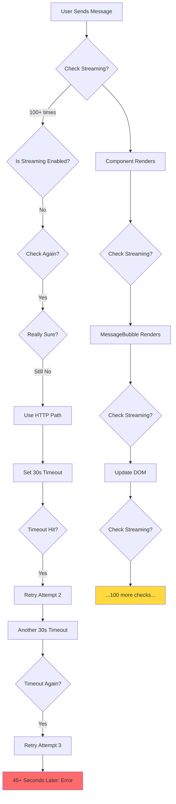
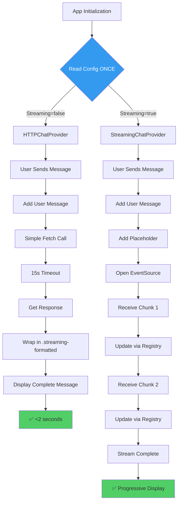
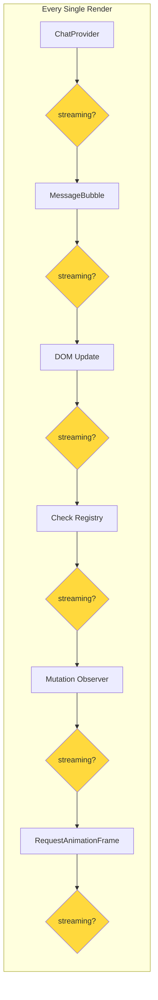
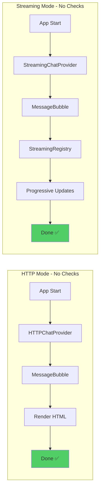
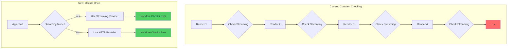
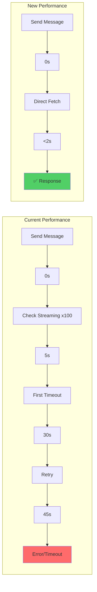
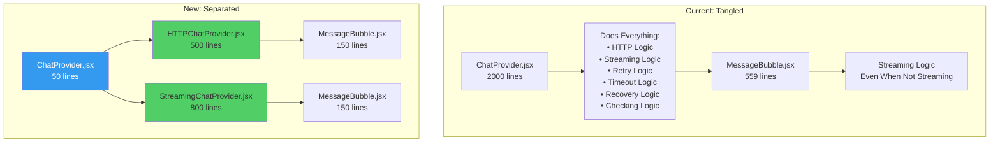

# Dual-Path Architecture Visual Flow Diagrams

## Current Architecture (BROKEN)


## New Dual-Path Architecture (FIXED)


## Component Flow - Current (BROKEN)


## Component Flow - New (FIXED)


## Decision Flow Comparison


## Performance Impact Visualization


## File Architecture


## Console Log Comparison
```
CURRENT CONSOLE (100+ lines):
================================
🚨 FORCE OVERRIDE ACTIVE: Streaming DISABLED
🚨 FORCE OVERRIDE ACTIVE: Streaming DISABLED  
🚨 FORCE OVERRIDE ACTIVE: Streaming DISABLED
[MessageBubble] Streaming globally disabled
🚨 FORCE OVERRIDE ACTIVE: Streaming DISABLED
[MessageBubble] Skipping text node creation
🚨 FORCE OVERRIDE ACTIVE: Streaming DISABLED
🚨 FORCE OVERRIDE ACTIVE: Streaming DISABLED
[MessageBubble] Skipping StreamingRegistry
🚨 FORCE OVERRIDE ACTIVE: Streaming DISABLED
... (repeats 100+ times) ...
⏱️ Timeout after 30 seconds
🔄 Retrying...
⏱️ Timeout after 30 seconds
🔄 Retrying...
❌ Error: Maximum retries exceeded

NEW CONSOLE (3 lines):
================================
🚀 CHAT PROVIDER INITIALIZED: HTTP MODE
📤 Sending message...
✅ Response received in 1.3s
```

## Memory Usage Visualization

```mermaid
graph TD
    subgraph "Current Memory Usage"
        Base1[Base: 50MB] --> Streaming1[+StreamingRegistry: 10MB]
        Streaming1 --> Observers[+MutationObservers: 5MB]
        Observers --> Retries[+Retry Queues: 5MB]
        Retries --> Unused[+Unused Streaming Code: 10MB]
        Unused --> Total1[Total: 80MB]
    end
    
    subgraph "New Memory Usage (HTTP Mode)"
        Base2[Base: 50MB] --> HTTP[+HTTP Provider: 5MB]
        HTTP --> Total2[Total: 55MB]
    end
    
    subgraph "New Memory Usage (Streaming Mode)"  
        Base3[Base: 50MB] --> Stream[+Streaming Provider: 15MB]
        Stream --> Total3[Total: 65MB]
    end
    
    style Total1 fill:#ff6b6b
    style Total2 fill:#51cf66
    style Total3 fill:#51cf66
```


## Summary Statistics
```
                    CURRENT         NEW (HTTP)      NEW (STREAMING)
Response Time:      45+ seconds     <2 seconds      Progressive
Streaming Checks:   100+ per msg    0               0
Memory Usage:       80MB            55MB            65MB
Code Complexity:    Very High       Low             Medium
Console Spam:       100+ lines      3 lines         5 lines
Timeouts:          3x30s           1x15s           N/A
Error Rate:        High            Low             Low
Developer Joy:      😭              😊              😊
```